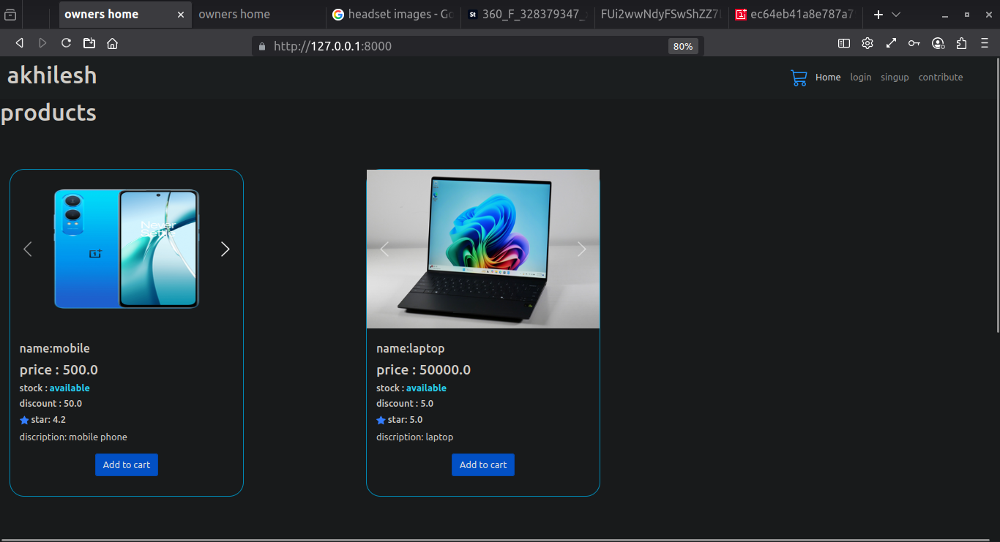
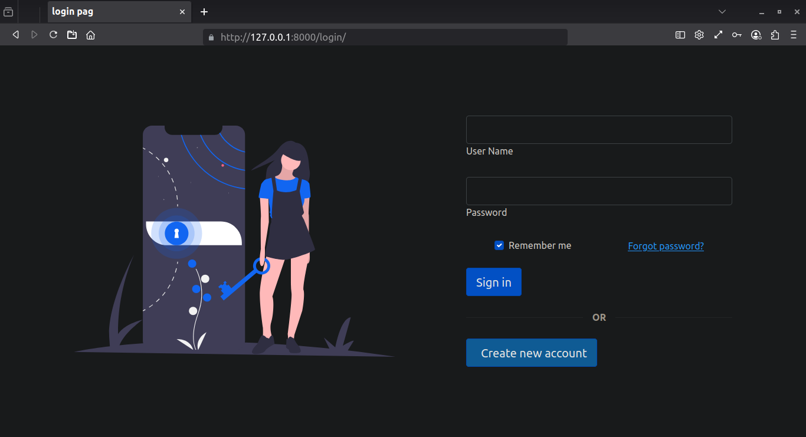
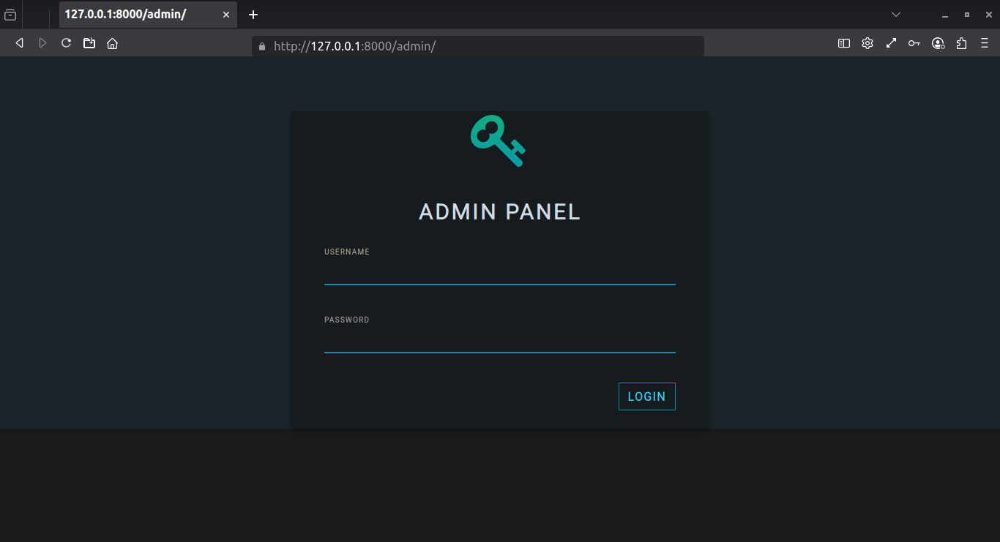
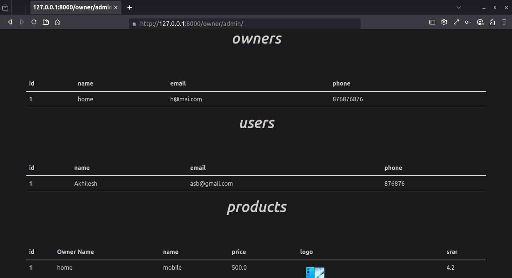
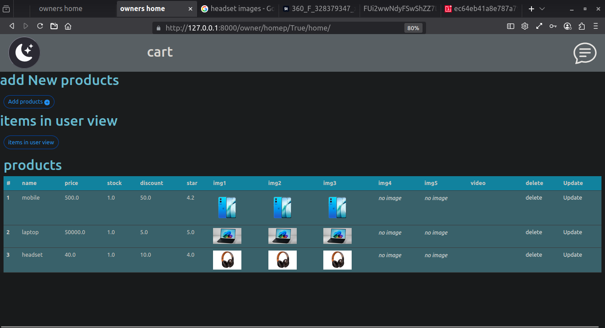

# Django Shopping Site (Beginner Project)

A basic e-commerce web application built with Django, featuring separate user and owner roles. Owners can add products, and users can browse, add products to a cart, and place orders. The app also includes a simple chat page for user-owner communication.

This project was created in 2021 as a beginner’s learning experience and covers essential CRUD operations without advanced features or security implementations.

---

## Features

* Separate tables for Users and Owners (no Django auth)
* Owners can add and manage products
* Users can browse products, add to cart, and place orders (no payment integration)
* Simple message board chat system between users and owners
* Built with Django, SQLite, HTML, CSS, jQuery, and Bootstrap

---

## Screenshots

## Installation
Don't install this app i build this to learn django

---

## Notes

* This is a beginner-level project with no user authentication or security.
* It uses SQLite as the database.
* No payment gateway or advanced e-commerce features included.
* Chat is implemented as a simple message board.

---
